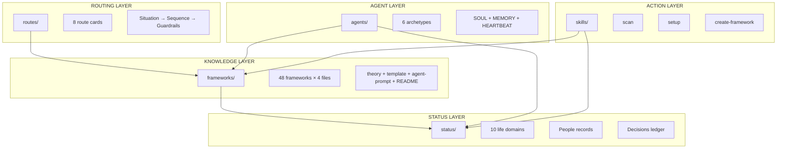
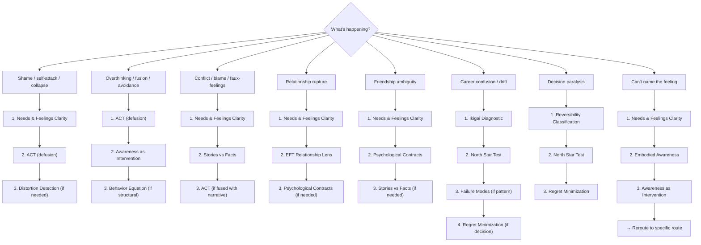
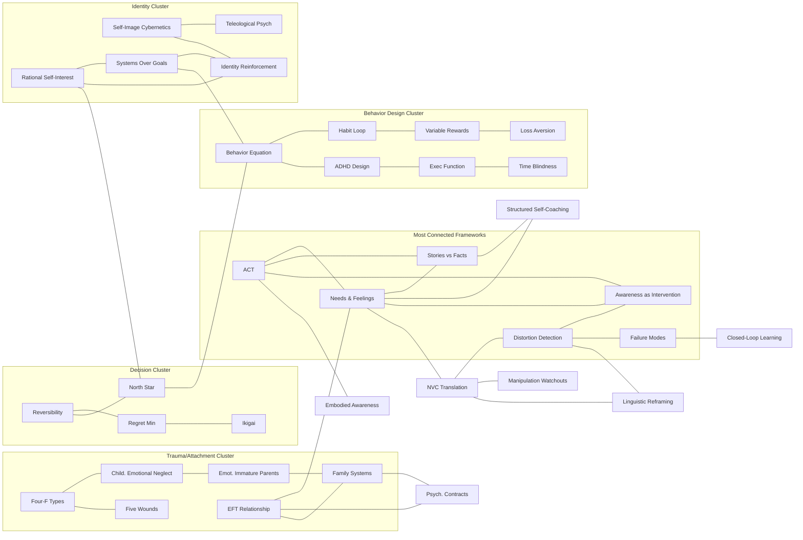

# Mirror Palace Framework Map

A visual reference for the entire Mirror Palace system: 48 frameworks across 16 categories, 8 situation routes, and how they connect.

---

## System Overview

```
Surface patterns  →  Calm the mind  →  Act with integrity  →  Live fully
```

Mirror Palace is a cognitive framework toolkit. It helps people see what's actually happening, choose useful frameworks for their situation, and act from clarity rather than reactivity. The system never prescribes a vision of the good life. It helps users discover and pursue their own.

---

## Architecture at a Glance



---

## The 16 Framework Categories

### Epistemology — How We Think About Thinking

Frameworks for reasoning, cognitive architecture, and information management.

| Framework | What It Does | Use When |
|-----------|-------------|----------|
| **Concept Formation** | Grounds reasoning in clear definitions | Reasoning feels ungrounded, concepts are vague, noise is overwhelming signal |
| **MIRROR Cognitive Architecture** | Structures persistent internal narratives for agents | Designing agent cognition, structuring persistent internal narratives |
| **Information Compression** | Decides what to keep vs. discard | Context is getting long, need to decide what to keep vs discard |

### Decision-Making — Choosing Under Uncertainty

Frameworks for making decisions when the path isn't obvious.

| Framework | What It Does | Use When |
|-----------|-------------|----------|
| **Reversibility Classification** | Sorts decisions into one-way and two-way doors | Any decision -- first classify it before analyzing. Many agonized-over decisions are actually reversible. |
| **Regret Minimization** | The 80-year-old test | High-stakes life choices, paralysis on big moves. "At 80, will you regret not doing this?" |
| **North Star Test** | Forces priority ranking | Evaluating features, actions, or priorities. What matters most? What would you sacrifice for what? |
| **Ikigai Diagnostic** | Maps capability, passion, need, and livelihood | Career/purpose misalignment, feeling lost about direction. Identifies which quadrant is empty. |

### Behavioral Psychology — Why People Do What They Do

Frameworks for understanding and designing behavior.

| Framework | What It Does | Use When |
|-----------|-------------|----------|
| **Jobs to Be Done** | Reveals what people actually hire a product/action to do | Designing products, understanding why people do things |
| **Behavior Equation** | Models motivation × ability × prompt | Building habits, designing interventions, things aren't getting done |
| **Habit Loop Design** | Cue → routine → reward architecture | Creating new habits or breaking old ones |
| **Variable Reward Schedules** | Explains engagement through unpredictable rewards | Designing engagement systems, maintaining motivation |
| **Loss Aversion** | Models the asymmetry of gains vs. losses | Streak design, notification language, framing choices |
| **Identity Reinforcement** | Connects actions to stated identity | Connecting actions to stated values, building confidence |

### Cognitive Therapy — Seeing Thinking Clearly

Frameworks for catching distortions, reframing, and using awareness itself as an intervention.

| Framework | What It Does | Use When |
|-----------|-------------|----------|
| **Distortion Detection** | Names common cognitive distortions | Catastrophizing, all-or-nothing thinking, should-statements. Names them clearly without pathologizing. |
| **Linguistic Reframing** | Shifts perspective through language | User is stuck, needs perspective shift, communication design |
| **Awareness as Intervention** | Names the pattern as the intervention | Pattern is recurring, naming it may be enough. Sometimes seeing it clearly is all you need. |

### Executive Function — Getting Things Done When the Brain Won't Cooperate

Frameworks for people with executive function variance.

| Framework | What It Does | Use When |
|-----------|-------------|----------|
| **Executive Function Model** | Maps which cognitive function needs support | Understanding which cognitive function needs support |
| **ADHD Design Rules** | Design principles for real humans | Designing systems for real humans with executive function variance |
| **Time Blindness** | Addresses the distorted sense of time | Scheduling, estimating duration, deadline language |

### Continuous Learning — Learning That Actually Sticks

| Framework | What It Does | Use When |
|-----------|-------------|----------|
| **Closed-Loop Learning** | Observe → model → test → revise cycle | Want to learn from experience, not just accumulate information |

### Self-Image — Who You Think You Are (and How That Shapes Everything)

Frameworks for understanding and reshaping self-concept.

| Framework | What It Does | Use When |
|-----------|-------------|----------|
| **Self-Image Cybernetics** | Models the self-concept as a thermostat | Self-concept is limiting behavior, identity doesn't match actions |
| **Teleological Psychology** | Examines hidden goals and belonging strategies | Examining hidden goals, belonging strategies, purpose narratives |
| **Systems Over Goals** | Replaces endpoint-chasing with sustainable practices | Building sustainable practices instead of chasing endpoints |
| **Rational Self-Interest** | Grounds self-prioritization in rational ethics | Guilt about self-prioritization, values misalignment, living by default rather than choice |

### Trauma Recovery — Understanding Where Patterns Come From

Frameworks for recognizing the origins of current patterns in past experience.

| Framework | What It Does | Use When |
|-----------|-------------|----------|
| **Four-F Survival Types** | Maps fight/flight/freeze/fawn responses | Stress response feels disproportionate, flashback-like reactions |
| **Childhood Emotional Neglect** | Identifies counter-dependence and emotional numbness patterns | Difficulty identifying needs, counter-dependence, emotional numbness |
| **Emotionally Immature Parents** | Recognizes parent patterns and internalization | Recognizing parent patterns, internalizer/externalizer dynamics |
| **Family Systems Differentiation** | Maps enmeshment, triangulation, multigenerational patterns | Enmeshment, triangulation, multigenerational patterns |
| **EFT Relationship Lens** | Attachment alarm, protest, withdrawal, rupture/repair | Repeating romantic conflict, pursue-withdraw dynamics |
| **Five Wounds** | Core wound identification and mask patterns | Core wound identification, mask patterns, body-pattern links |

### Coaching — Structured Reflection and Action

Frameworks for self-coaching, narrative separation, and values-guided movement.

| Framework | What It Does | Use When |
|-----------|-------------|----------|
| **Structured Self-Coaching** | Weekly reflection practice | Weekly reflection, need structured growth practice |
| **Stories vs Facts** | Separates narrative from observable reality | Narrative is running the show, need to separate story from reality |
| **Developmental Stages** | Assesses readiness for challenge vs. need for safety | Assessing readiness for challenge vs need for safety |
| **Acceptance & Commitment Therapy (ACT)** | Defusion, acceptance, values, committed action | Fusion, avoidance, shame spirals, comparison, or overprocessing are blocking values-guided action |
| **Needs & Feelings Clarity** | Separates feelings from interpretations, needs from strategies | Emotional language is muddy, accusation-heavy, or confused with strategy |
| **NVC Translation** | Mode-aware rewriting engine: produces OFNR-shaped self-expression, empathy guesses, boundary language, or clarity requests — and refuses to sanitize abuse, evidence, or safety language | Drafting an outgoing message during conflict, generating an empathy guess, distinguishing a request from a demand, or producing clean boundary language |

### Influence Defense — Recognizing What's Being Done to You

Frameworks for detecting manipulation, pressure, and power dynamics. Defensive only.

| Framework | What It Does | Use When |
|-----------|-------------|----------|
| **Behavioral Signal Reading** | Reads interpersonal dynamics and incongruence | Something feels off in a conversation, reading dynamics |
| **Leverage Point Awareness** | Recognizes power dynamics and pressure tactics | Recognizing power dynamics, negotiation, someone applying pressure |
| **Manipulation Watchouts** | Identifies specific manipulation techniques | Feeling pressured, reciprocity trap, authority play, scarcity push |

### Somatic — The Body Knows Things the Mind Doesn't

Frameworks for body-based awareness and repatterning.

| Framework | What It Does | Use When |
|-----------|-------------|----------|
| **Subconscious Repatterning** | Bridges cognitive understanding to behavioral change | Cognitive understanding isn't translating to behavior change |
| **Embodied Awareness** | Gets out of the head and into felt experience | Need to get out of the head, body has information |

### Personality Assessments — Self-Knowledge Tools

Frameworks for understanding behavioral tendencies and motivation patterns.

| Framework | What It Does | Use When |
|-----------|-------------|----------|
| **Big Five** | Maps openness, conscientiousness, extraversion, agreeableness, neuroticism | Building self-knowledge, understanding behavioral tendencies |
| **Enneagram** | Maps motivation patterns and stress/growth dynamics | Understanding motivation patterns, stress/growth dynamics |
| **MBTI** | Maps communication style and cognitive preferences | Communication style, cognitive function preferences |

### Pattern Detection — Naming What Keeps Happening

| Framework | What It Does | Use When |
|-----------|-------------|----------|
| **Failure Modes** | Names recurring behavioral patterns that undermine goals | Recurring behavioral pattern detected, need to name and intervene |
| **Psychological Contracts** | Surfaces invisible relational agreements | Invisible relational agreements, nervous system bias in relationships |

### Anti-Patterns — What Not to Build

| Framework | What It Does | Use When |
|-----------|-------------|----------|
| **System Anti-Patterns** | Identifies common productivity system failures | Designing or auditing a productivity/tracking system |

### Integrated Practice — Bringing It All Together

| Framework | What It Does | Use When |
|-----------|-------------|----------|
| **Rational Yoga** | Unified physical/psychological/ethical practice | Seeking unified practice grounded in evidence, not mysticism |

---

## Route Map — Situation-Based Framework Selection

Routes are the structured middle layer between "I know something is wrong" and "here's a framework." Each route maps a situation class to a framework sequence with ordering rationale, contraindications, and fallbacks.

### How to Use Routes

1. Find the situation that matches what you're experiencing
2. Read the route card
3. Follow the recommended sequence
4. Check the "Stop If" conditions after each step
5. If the route doesn't fit, try a fallback

### The 8 v1 Routes



### Route Detail Cards

#### Shame / Self-Attack / Collapse

**The problem:** Shame spirals self-reinforce. The user generates evidence for the shame narrative, which deepens fusion, which generates more evidence. Common bad responses (reassurance, advice, root-cause analysis) don't address the core mechanism: fusion with shame thoughts.

**The sequence:**
1. **Needs & Feelings Clarity** -- Clean the language. "I am worthless" is fusion. "I feel ashamed" is cleaner. ACT can't work on muddy language.
2. **ACT** -- Defuse from the shame thought. Name it as a thought. Identify what's being avoided. Return to values. Choose committed action.
3. **Distortion Detection** (optional) -- If specific cognitive distortions persist (all-or-nothing, mental filtering, "should" statements), name them.

**Stop if:** User becomes more activated. Childhood material surfaces they're not ready for. The shame is connected to ongoing harm.

**Not this route if:** The shame is appropriate guilt about genuinely harmful behavior. The user needs stabilization first.

---

#### Overthinking / Fusion / Avoidance

**The problem:** Overthinking masquerades as diligence. The user feels productive because they're "working on it" mentally, but no action occurs. The thinking itself is the avoidance strategy.

**The sequence:**
1. **ACT** -- Name the fusion. What thought is being treated as a barrier? What experience is being avoided? Clarify values. Identify smallest committed action.
2. **Awareness as Intervention** (optional) -- Sometimes naming the pattern is enough. "You're ruminating, not deliberating" can break the loop.
3. **Behavior Equation** (optional) -- If "I know what to do but can't start," the problem may be structural (no trigger, too hard, motivation mismatch), not psychological.

**Stop if:** ACT becomes another layer of overthinking. The stuck-ness masks a real constraint.

**Not this route if:** The "overthinking" is legitimate deliberation on a genuinely complex decision. The rumination has a shame quality.

---

#### Conflict / Blame / Faux-Feelings

**The problem:** "I feel abandoned" is not a feeling. "I feel betrayed" is not a feeling. These are interpretations encoded as feelings, and they escalate conflict because each person hears accusations, not vulnerability.

**The sequence:**
1. **Needs & Feelings Clarity** -- Translate faux feelings into actual feelings. Translate accusations into observations. Identify the underlying need. This alone resolves many conflicts.
2. **Stories vs Facts** (optional) -- If the user runs a strong narrative about motives ("they did it on purpose"), separate facts from story.
3. **ACT** (optional) -- If fused with the conflict narrative and can't let go, defuse and reconnect to values.

**Stop if:** NFC is being used to tone-police legitimate anger. The user is more interested in being right.

**Not this route if:** The conflict involves real harm. The issue is a genuine attachment rupture.

---

#### Relationship Rupture / Attachment Activation

**The problem:** Attachment-activated conflict gets processed at the surface level. The couple argues about content when the real issue is connection and safety.

**The sequence:**
1. **Needs & Feelings Clarity** -- Clean the language. Attachment-activated language is almost always distorted.
2. **EFT Relationship Lens** -- Map the pursue-withdraw or attack-defend cycle. Name the attachment alarm underneath. Identify where the repair window is.
3. **Psychological Contracts** (optional) -- If invisible agreements were violated ("I thought we agreed..."), surface and examine them.

**Stop if:** EFT language is being used to diagnose the partner. The framework is justifying staying in a harmful dynamic.

**Not this route if:** Active abuse or coercion. Primarily logistical conflict. Very new relationship.

---

#### Friendship Ambiguity / Mixed Signals

**The problem:** Not every relational issue is romantic or attachment-driven. Friendships have their own dynamics: unclear reciprocity, invisible contracts, effort imbalances that go unspoken.

**The sequence:**
1. **Needs & Feelings Clarity** -- What does the user actually need from this friendship? Separate feeling from interpretation.
2. **Psychological Contracts** -- What invisible agreement does the user believe exists? Naming it makes it discussable.
3. **Stories vs Facts** (optional) -- If the user has strong motives-attribution ("they don't care"), separate behavior from narrative.

**Not this route if:** The bond is deep enough for attachment dynamics. The "friendship" involves manipulation.

---

#### Career Confusion / Stuckness / Drift

**The problem:** Career stuckness generates two loops: endless information gathering or impulsive pivots. Both avoid the harder question of what actually matters.

**The sequence:**
1. **Ikigai Diagnostic** -- Map capability, passion, need, livelihood. Which quadrant is empty?
2. **North Star Test** -- Prioritize within the landscape. What would you sacrifice for what?
3. **Failure Modes** (optional) -- If the stuckness has a recurring pattern (starts enthusiastically, fades in 6 weeks), name it.
4. **Regret Minimization** (optional) -- For specific high-stakes decisions. "At 80, will you regret not trying this?"

**Not this route if:** The stuckness is actually depression or burnout. The user has clear direction but is blocked by a specific constraint.

---

#### Values Conflict / Decision Paralysis

**The problem:** Genuinely competing values make a decision feel impossible. This is different from overthinking (which is avoidance-driven) -- here the tradeoffs are real.

**The sequence:**
1. **Reversibility Classification** -- Is this a one-way or two-way door? This single step resolves a surprising number of cases.
2. **North Star Test** -- If genuinely hard, force priority ranking. What matters most?
3. **Regret Minimization** -- Tiebreaker. At 80, which choice will you regret not making?

**Not this route if:** The paralysis is fear-driven. The decision involves another person and relational dynamics.

---

#### Emotional Signal Unclear (Meta-Route)

**The problem:** The user knows something is off but can't identify what. This is the entry point for people who can't yet name their situation.

**The sequence:**
1. **Needs & Feelings Clarity** -- What are you observing? Feeling? Needing?
2. **Embodied Awareness** -- If cognitive language isn't working, drop into the body. Where is the sensation?
3. **Awareness as Intervention** -- Sometimes naming "I don't know what I'm feeling" is enough.

**Then reroute.** Once the feeling or need becomes clearer, move to the appropriate situation-specific route.

---

## Framework Relationships



---

## The 6 Agent Archetypes

Agents are pre-built personalities that apply frameworks in distinct styles.

| Agent | Role | What It Does | Key Frameworks |
|-------|------|-------------|----------------|
| **The Mirror** | Pattern detection | Names contradictions, tracks patterns across weeks, asks the hard questions. Warm but not soft. | failure-modes, distortion-detection, awareness-as-intervention, regret-minimization |
| **The Briefer** | Daily briefing | Morning state report. "What's Working" before pattern alerts. State-responsive -- minimal on hard days. | north-star-test, failure-modes |
| **The Tracker** | Progress tracking | Reports positive trends alongside gaps. Tracks reciprocity in relationships. | identity-reinforcement, systems-over-goals |
| **The Strategist** | Strategic planning | Recommends releasing goals, not just adding them. "Who else does this matter to?" | ikigai-diagnostic, regret-minimization |
| **The Operator** | Domain execution | Handles operational tasks within a specific domain. Notes stakeholder impact. | behavior-equation, executive-function-model |
| **The Watcher** | Change detection | Monitors for significant shifts. Writes change logs for other agents. | awareness-as-intervention, failure-modes |

---

## The Status System

Mirror Palace tracks life data across three dimensions:

### 10 Life Domains
Each domain has a Red/Yellow/Green status, a numeric score, and domain-specific tracking columns.

| Domain | Tracks |
|--------|--------|
| Career & Work | Role satisfaction, growth, alignment |
| Partner & Love | Relationship health, communication, intimacy |
| Family & Friends | Connection quality, reciprocity, boundaries |
| Health & Fitness | Physical health, exercise, sleep, energy |
| Money & Finances | Financial health, security, spending alignment |
| Personal Growth & Learning | Development, learning application, self-knowledge |
| Fun & Recreation | Play, creativity, enjoyment |
| Environment | Living space, tools, physical surroundings |
| Community | Belonging, contribution, social connection |
| Spirituality | Meaning, practice, purpose |

### People Records
Bidirectional relationship tracking: what they give you (Support%) and what you give them (Giving%). Needs met and unmet. Contact frequency.

### Decisions Ledger
Active decisions with status, reversibility classification, affected domains, affected people, and the option to mark a decision as "released" -- consciously let go, not just deferred.

---

## Key Concepts

### Frameworks as Lenses
A framework is a way of looking at a situation. It highlights certain aspects and downplays others. No framework is complete. Multiple frameworks applied in sequence can illuminate what a single one misses. The goal is not to find the "right" framework but to find a useful one.

### Routes as Hypotheses
Routes suggest framework sequences for common situations. They are not prescriptions. Every route includes "When NOT to Use" and "Stop If" sections because the system's suggestions should be easy to override.

### Continuous Learning
Mirror Palace is a living system. Every interaction can surface data that updates status domains, people records, or the decisions ledger. The system proposes updates; the user confirms with a yes/no. Low friction is mandatory.

### Pacing
When the user's state is activated or distressed, lead with presence and grounding before analysis. Naming a pattern can agitate as easily as it can calm. Match the system's intensity to the user's capacity to receive.

### Thriving Is Data
A system that only finds what's broken trains the user to see only what's broken. Sustained satisfaction, warm relationships, aligned values, and earned contentment are worth capturing and naming with the same rigor as problems.

---

## Quick Reference: Which Framework for What

| I need to... | Start with |
|-------------|-----------|
| Make a decision | Reversibility Classification |
| Understand why I'm stuck | Failure Modes |
| Stop overthinking | ACT |
| Clean up emotional language | Needs & Feelings Clarity |
| Understand a relationship conflict | EFT Relationship Lens |
| Figure out my career direction | Ikigai Diagnostic |
| Build a habit | Behavior Equation + Habit Loop Design |
| Catch my cognitive distortions | Distortion Detection |
| Design for executive function variance | ADHD Design Rules |
| Understand my personality patterns | Big Five + Enneagram |
| Recognize manipulation | Manipulation Watchouts |
| Connect body and mind | Embodied Awareness |
| Learn from experience | Closed-Loop Learning |
| Build a sustainable practice | Systems Over Goals |

---

*48 frameworks. 8 routes. 6 agents. 10 domains. One system.*

*See [index.md](index.md) for the full framework matrix. See [routes/](routes/) for situation-based routing. See [docs/ARCHITECTURE.md](docs/ARCHITECTURE.md) for the technical architecture.*
