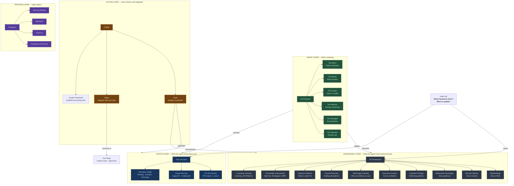
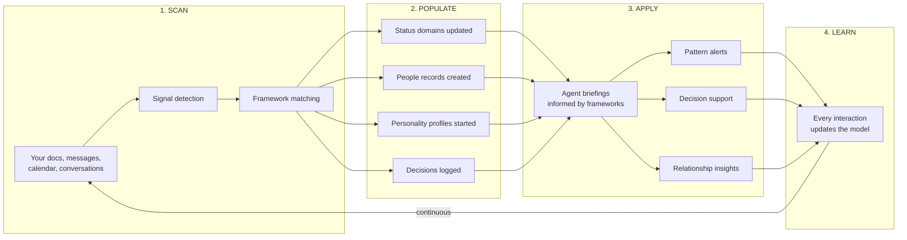
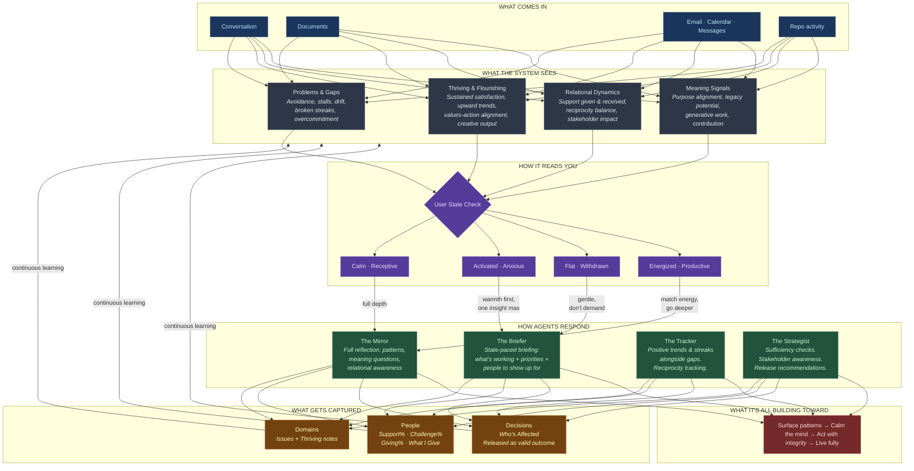
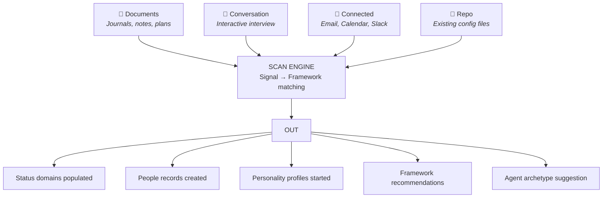

# Mirror Palace

### A cognitive framework toolkit that teaches AI agents how *you* work — so they can help you work better.

> **Security-first public-repo rule:** This repository contains only generalized framework content. Personal/user-specific data must remain segregated in private systems and never be committed here.

---

## Why This Exists

AI agents are getting good at remembering what you're working on. Your projects, your tasks, your calendar, your code. That's table stakes.

What they don't remember is **how you work**. How you make decisions. Where you freeze. What triggers your avoidance. Which relationships drain you. What your stress response looks like. What you actually mean when you say "I'm fine." How your energy moves through the day. What you lie to yourself about.

That second kind of memory — the memory of *you* — is where the real leverage is.

> **Project memory helps you finish things.**
> **Self-knowledge memory helps you build a life that works.**

A calendar briefing tells you what's happening today. Mirror Palace tells the agent *who is showing up today* — and what that person actually needs to hear.

The difference between a prescient daily briefing and a transformative one isn't more data. It's depth. It's the agent knowing that when you start three new projects in a week, you're probably avoiding something. That when you go quiet in relationships, it's not preference — it's a pattern. That your best work happens in specific energy windows and everything outside those windows is friction pretending to be discipline.

Mirror Palace is the structured knowledge base that makes that depth possible. Not a personality quiz. Not a chatbot with a memory feature. A comprehensive, continuously-learning system of 35+ psychological frameworks, behavioral science models, and self-knowledge instruments — organized so AI agents can actually use them in real-time to help you grow, decide, and act with less suffering and more clarity.

---

## Architecture



---

## How It Works



**The cycle never stops.** Every conversation is a data point. Every framework application is a chance to update your status, refine your personality profile, or catch a pattern. The system gets more useful over time — not because it stores more, but because it understands more.

### The Full Picture

The cycle above shows the mechanics. The diagram below shows *how the system thinks* — what it detects, how it responds, and what it's ultimately building toward.



**What changed from a typical self-knowledge system:**

| Traditional Approach | Mirror Palace |
|---------------------|---------------|
| Detect problems | Detect problems **and** thriving |
| Track what others do for you | Track what you give **and** receive |
| Always analyze | Read your state — **back off when you need calm** |
| Optimize endlessly | Know when **enough is enough** |
| Self-focused | **Stakeholder-aware** — who else does this affect? |
| Clarity as the goal | Clarity **in service of** a fulfilling life |

---

## The 10 Life Domains

Every area of your life gets tracked, scored, and cross-linked.

```
┌─────────────────────────────────────────────────────────────┐
│                     ISSUE INDEX                              │
│  Cross-domain view · RYG status · Scores · Linked issues     │
├──────────┬──────────┬──────────┬──────────┬─────────────────┤
│ FIN-001  │ CAR-003  │ HLT-002  │ PAR-001  │ GRO-004        │
│ 🔴 35    │ 🟡 62    │ 🟢 78    │ 🟡 55    │ 🟢 82          │
└──────────┴──────────┴──────────┴──────────┴─────────────────┘
```

| Domain | Prefix | Tracks |
|--------|--------|--------|
| **Money & Finances** | `FIN` | Burn rate, runway, income streams, targets |
| **Career & Work** | `CAR` | Role type, stage, leverage score |
| **Health & Fitness** | `HLT` | Sleep/exercise/nutrition, frequency, energy impact |
| **Fun & Recreation** | `FUN` | Activity type, social/solo, recharge score |
| **Environment** | `ENV` | Home/work/third-place, friction level |
| **Community** | `COM` | Group/scene, role, belonging score |
| **Family & Friends** | `FAM` | Contact frequency, reciprocity score |
| **Partner & Love** | `PAR` | Communication quality, polarity, growth trajectory |
| **Personal Growth** | `GRO` | Domain, format, active/paused, integration level |
| **Spirituality** | `SPR` | Practice type, frequency, depth, daily integration |

**Plus:** People Records (support%, challenge%, giving% — what you receive AND what you give) and a Decisions Ledger (status, reversibility, who's affected, domain links, regret check).

---

## The Framework Library

36 frameworks across 15 categories. Each one has:

| File | Purpose |
|------|---------|
| `theory.md` | Deep explanation of the concept — real depth, not summaries |
| `template.md` | Ready-to-fill worksheet — the framework made personal |
| `agent-prompt.md` | Copy-paste snippet for agents to apply it |
| `README.md` | YAML metadata: when to use, when to avoid, what to update |

### Categories at a Glance

```
EPISTEMOLOGY                    DECISION-MAKING
├── Concept Formation           ├── Reversibility Classification
├── MIRROR Architecture         ├── Regret Minimization
└── Information Compression     ├── North Star Test
                                └── Ikigai Diagnostic

BEHAVIORAL PSYCHOLOGY           COGNITIVE THERAPY
├── Jobs to Be Done             ├── Distortion Detection
├── Behavior Equation           ├── Linguistic Reframing
├── Habit Loop Design           └── Awareness as Intervention
├── Variable Reward Schedules
├── Loss Aversion               EXECUTIVE FUNCTION
└── Identity Reinforcement      ├── Executive Function Model
                                ├── ADHD Design Rules
SELF-IMAGE                      └── Time Blindness
├── Self-Image Cybernetics
├── Teleological Psychology     CONTINUOUS LEARNING
└── Systems Over Goals          └── Closed-Loop Learning

TRAUMA RECOVERY                 COACHING
├── Four-F Survival Types       ├── Structured Self-Coaching
├── Childhood Emotional Neglect ├── Stories vs Facts
├── Emotionally Immature Parents└── Developmental Stages
├── Family Systems
└── Five Wounds                 INFLUENCE DEFENSE ⚠️
                                ├── Behavioral Signal Reading
SOMATIC                         ├── Leverage Point Awareness
├── Subconscious Repatterning   └── Manipulation Watchouts
└── Embodied Awareness
                                PERSONALITY ASSESSMENTS
PATTERN DETECTION               ├── Big Five (OCEAN)
├── Failure Modes (7 types)     ├── Enneagram (9 types)
└── Psychological Contracts     └── MBTI (16 types)

ANTI-PATTERNS                   INTEGRATED PRACTICE
└── System Anti-Patterns (12)   └── Rational Yoga
```

> ⚠️ **Influence Defense** is explicitly *defensive* — recognizing techniques used on you, not techniques to use on others.

---

## Agent Archetypes

Six pre-built agent personalities. Deploy one or all six.

| Archetype | What It Does | Voice |
|-----------|-------------|-------|
| **The Mirror** | Detects patterns across weeks. Names what's working and what you're avoiding. Asks "what is this in service of?" Notices relational imbalances. Paces to your state. | Like a letter from a friend who knows you deeply |
| **The Briefer** | "3 things that matter today." Leads with what's working. Adjusts briefing intensity to your energy and emotional state. | Sharp chief of staff |
| **The Tracker** | "You said X. You did Y." Reports positive trends and sustained streaks alongside gaps. Tracks relational reciprocity. | Terse, factual, no judgment |
| **The Watcher** | Monitors changes across repos, docs, status. Flags drift. | Methodical completist |
| **The Strategist** | Tracks goal pipelines. Flags stalls. Recommends releasing goals that no longer serve. Asks "who else does this matter to?" | Strategic but direct |
| **The Operator** | Domain-specific ops. Watches signals, drafts responses. Notes stakeholder impact. | Operational, brief |

Each archetype has a `SOUL.md` (personality + scope), `MEMORY.md` (what it knows), `HEARTBEAT.md` (when it runs), and a `README.md` explaining when to deploy it.

---

## The Scan Skill — How It Learns About You

Four modes, all feeding the same system:



**Continuous Learning Protocol:** The scan isn't a one-time setup. Every conversation is a potential data point. The system proposes low-friction updates as you talk — one line at a time, confirm or skip. Over weeks and months, it builds a progressively richer model of who you are and how you operate.

---

## Quick Start

| Path | Time | Start Here |
|------|------|-----------|
| **Browse frameworks** | 5 min | [`index.md`](index.md) — the master routing table |
| **Understand yourself** | 15 min | Run the scan skill on your existing documents |
| **Build an agent** | 10 min | [`agents/archetypes/`](agents/archetypes/) — pick one |
| **Integrate with your repo** | 10 min | [`guides/getting-started.md`](guides/getting-started.md) |
| **Daily practice** | 3 min/day | [`daily/briefing-template.md`](daily/briefing-template.md) |

---

## Integration

Works with **Claude Code** and **OpenClaw**.

```
┌─────────────────────────────────┐
│         YOUR REPO               │
│  AGENTS.md ← references MP     │
│  CLAUDE.md ← continuous learn   │
│  agents/   ← deployed types     │
│  memory/   ← agent memory       │
├─────────────────────────────────┤
│    ↕ scan populates  ↕ setup    │
├─────────────────────────────────┤
│       MIRROR PALACE             │
│  frameworks/ (knowledge)        │
│  status/    (your data)         │
│  agents/    (archetypes)        │
│  skills/    (scan+setup+create) │
│  daily/     (process)           │
│  index.md   (routing table)     │
└─────────────────────────────────┘
```

See [`guides/claude-code-setup.md`](guides/claude-code-setup.md) or [`guides/openclaw-setup.md`](guides/openclaw-setup.md).

---

## Philosophy

The system optimizes for **clarity in service of flourishing** — not just seeing yourself clearly, but using that clarity to build a life worth living.

```
Surface patterns  →  Calm the mind  →  Act with integrity  →  Live fully
```

Every component is oriented toward this progression: agents detect what's working alongside what's broken, adjust their intensity to your state, track relational reciprocity (not just what you receive), consider who else your decisions affect, and know when enough is enough.

See [`docs/ROADMAP.md`](docs/ROADMAP.md) for the full philosophy and how it's applied.

---

## The Deeper Point

Most productivity tools optimize for output: more tasks done, more habits tracked, more data collected.

Mirror Palace optimizes for **understanding**. The bet is simple: an agent that deeply understands how you operate — your patterns, your wounds, your strengths, your decision-making tendencies, your relationship dynamics, your energy rhythms — can do more for you in a 3-minute morning briefing than a feature-rich task manager can do in a year.

This isn't about building a better to-do list. It's about building a system that knows:
- When you say "I'll start Monday" you mean "I'm avoiding this"
- When your calendar fills up it's not ambition, it's over-commitment
- When you go quiet in relationships it's a pattern, not a preference
- When you compare yourself to others it means your self-worth is untethered from your actual work
- When you start something new with intense energy, the follow-through is where the real test is

That knowledge — structured, accessible, continuously updated — is what turns a helpful assistant into a genuine thinking partner. One that doesn't just tell you what's on your calendar, but helps you build a life with less friction, less self-deception, and more of the clarity that actually moves things forward.

---

## Acknowledgments

This project grew out of too many late nights, too many frameworks studied, and too many projects running at once. It draws from the memory palace tradition, graph-based knowledge systems like Graphify, and every psychology, behavioral science, coaching, and self-development framework I've ever studied and actually applied — there are genuinely too many to list.

If you recognize your work in here and feel it needs a credit, reach out. The frameworks are described by concept, not by name, because this is a toolkit for application, not an academic citation index. But the ideas belong to the people who developed them, and this project wouldn't exist without their work.

---

## License

MIT
