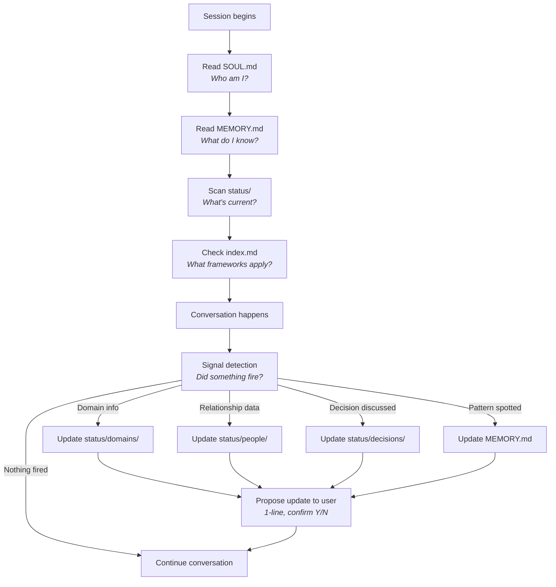
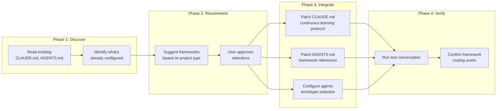

# How Mirror Palace Works

A technical explanation of the memory architecture, retrieval system, and continuous learning loop.

---

## The Two Types of Agent Memory

Most AI agent systems focus on one kind of memory: **project memory**. What are we building? What's the current task? What happened in the last conversation? This is useful but shallow — it helps finish things.

Mirror Palace adds a second kind: **self-knowledge memory**. How does this person make decisions? What are their stress patterns? Where do they freeze? What relationships are they avoiding? What do they tell themselves versus what's actually happening?

```
┌─────────────────────────────────────────────────────────┐
│                   AGENT MEMORY                           │
│                                                          │
│  ┌─────────────────┐    ┌─────────────────────────────┐ │
│  │  PROJECT MEMORY  │    │  SELF-KNOWLEDGE MEMORY      │ │
│  │                  │    │                              │ │
│  │  Tasks           │    │  Decision patterns           │ │
│  │  Deadlines       │    │  Stress responses            │ │
│  │  Code state      │    │  Energy rhythms              │ │
│  │  Conversations   │    │  Relationship dynamics       │ │
│  │  Files changed   │    │  Cognitive distortions       │ │
│  │                  │    │  Personality profile          │ │
│  │  ─────────────── │    │  Failure modes               │ │
│  │  Helps you       │    │  Hidden contracts            │ │
│  │  FINISH things   │    │  Identity beliefs            │ │
│  │                  │    │  Trauma patterns             │ │
│  └─────────────────┘    │                              │ │
│                          │  ─────────────────────────── │ │
│                          │  Helps you BUILD A LIFE      │ │
│                          │  that actually works          │ │
│                          └─────────────────────────────┘ │
└─────────────────────────────────────────────────────────┘
```

Project memory is transactional. Self-knowledge memory is transformational.

---

## Memory Architecture

Mirror Palace structures self-knowledge into three tiers:

### Tier 1: Frameworks (Knowledge Layer)
**What the agent knows about humans in general.**

35 frameworks of psychology, behavioral science, and decision-making theory. These don't change per user — they're the agent's training in human nature. When the agent sees a pattern, frameworks tell it what the pattern means and what to do about it.

```
frameworks/
├── epistemology/           → How to reason clearly
├── decision-making/        → How to decide well
├── behavioral-psychology/  → How people actually behave
├── cognitive-therapy/      → How to reframe unhelpful thoughts
├── executive-function/     → How focus and initiation work
├── self-image/             → How identity shapes behavior
├── trauma-recovery/        → How old wounds drive current patterns
├── coaching/               → How to guide growth
├── influence-defense/      → How to spot manipulation
├── personality-assessments/ → Structured self-knowledge instruments
├── pattern-detection/      → How to name what's happening
├── anti-patterns/          → What not to build
├── somatic/                → Body-based intelligence
└── continuous-learning/    → How to learn from experience
```

### Tier 2: Status (Data Layer)
**What the agent knows about you specifically.**

This is the living, continuously-updated model of your life. Every conversation can update it. It's organized into 10 life domains, people records, and a decisions ledger.

```
status/
├── domains/
│   ├── money-finances.md       → Burn rate, runway, streams
│   ├── career-work.md          → Role, stage, leverage score
│   ├── health-fitness.md       → Sleep, exercise, energy
│   ├── fun-recreation.md       → Activities, recharge score
│   ├── environment.md          → Home, work, friction level
│   ├── community.md            → Groups, belonging score
│   ├── family-friends.md       → Contact frequency, reciprocity
│   ├── partner-love.md         → Communication, polarity, growth
│   ├── personal-growth.md      → Learning domain, integration
│   └── spirituality.md         → Practice type, depth
│
├── people/
│   ├── [person].md             → Support%, challenge%, needs
│   └── PEOPLE-INDEX.md         → Master roster
│
└── decisions/
    ├── [decision].md           → Status, reversibility, regret check
    └── DECISIONS-INDEX.md      → Active decision pipeline
```

### Tier 3: Agent Memory (Runtime Layer)
**What specific agents remember across sessions.**

Each agent archetype maintains its own memory files — what it observed, what it recommended, what changed. This is where pattern detection happens over time.

```
agents/archetypes/the-mirror/
├── SOUL.md      → Who am I? (personality, scope, voice)
├── MEMORY.md    → What do I know? (persistent observations)
├── HEARTBEAT.md → When do I run? (schedule, triggers)
└── WORKING.md   → What am I doing right now? (session state)
```

---

## The Retrieval Flow

When an agent starts a session, here's what happens:



**Key principle: low friction updates.** The agent never asks the user to fill out a form. It proposes a specific 1-line update based on what the user said, and the user confirms or skips. Over time, this builds a rich model with almost zero effort.

---

## The Setup Flow

How Mirror Palace integrates with an existing repo:



**Consent at every step.** The setup skill shows exactly what it wants to change and asks permission before each modification. Nothing is automatic.

---

## Communication Optimization Path (Planned)

For communication-heavy requests, Mirror Palace can run an additional language-quality pass before final response delivery.

**Execution order**
1. Route selection + framework sequence
2. Cognitive/emotional synthesis from selected frameworks
3. Optional `confidence_language_analysis` overlay
4. Final response generation

This keeps confidence coaching modular: the system first decides *what* to say using existing frameworks, then improves *how* to say it with context-aware language scoring and rewrites.

See `docs/confidence-language/` for taxonomy, scoring, and implementation sequencing.

---

## The Daily Cycle

Once integrated, Mirror Palace runs a daily rhythm:

```
    MORNING                         MIDDAY                      EVENING
    ───────                         ──────                      ───────
    ┌──────────────┐               ┌──────────────┐            ┌──────────────┐
    │   BRIEFING   │               │   CHECK-IN   │            │  REFLECTION  │
    │              │               │              │            │              │
    │ • State check│               │ • Energy now │            │ • What fired │
    │ • Calendar   │               │ • Blockers   │            │ • What moved │
    │ • 3 priority │               │ • Adjust     │            │ • What to    │
    │   items      │               │   priorities │            │   update     │
    │ • Framework  │               │              │            │ • Framework  │
    │   of the day │               │              │            │   notes      │
    └──────────────┘               └──────────────┘            └──────────────┘
          │                               │                           │
          ▼                               ▼                           ▼
    Status domains              Status domains              Status domains
    People records              People records              People records
    Decisions ledger            Decisions ledger            Decisions ledger
    ─────────────────────────────────────────────────────────────────────
                    CONTINUOUS LEARNING LOOP
                    Every touchpoint is a data capture opportunity
```

The morning briefing isn't just "here's your calendar." It's: given what I know about your energy patterns, your current stress points, your open decisions, and the framework we explored yesterday — here's what actually matters today and here's the one thing you're probably avoiding.

---

## Why This Changes Everything

An OpenClaw agent with calendar access can tell you: "You have a meeting at 2pm."

An OpenClaw agent with Mirror Palace can tell you:
- "You have a meeting with [person] at 2pm. Based on your people record, this relationship has high challenge% and you tend to over-accommodate. The manipulation-watchouts framework flags that they often use commitment/consistency pressure. Your energy is typically low at 2pm. Consider rescheduling to your peak window, or at minimum, review the leverage-point-awareness template before the call."

That's not more information. That's **better understanding applied to the same information.**

The daily briefing becomes a coaching session. The calendar becomes a strategic tool. The decisions ledger becomes an accountability partner that remembers what you actually decided and checks whether you're following through.

The difference isn't features. It's depth. And depth comes from structured self-knowledge that accumulates over time, organized by frameworks that know what to look for and what it means.

---

## Getting Started

1. **Quick browse**: Read [`index.md`](index.md) to see what frameworks exist
2. **Initial scan**: Run the scan skill on your existing documents to bootstrap your status data
3. **Daily practice**: Start with the morning briefing template — 3 minutes, every day
4. **Gradual depth**: Let the continuous learning loop build your profile over weeks

The system is designed to start simple and get deeper. You don't need to fill out 35 templates on day one. You need to show up, talk to the agent, and let the frameworks do their work.
