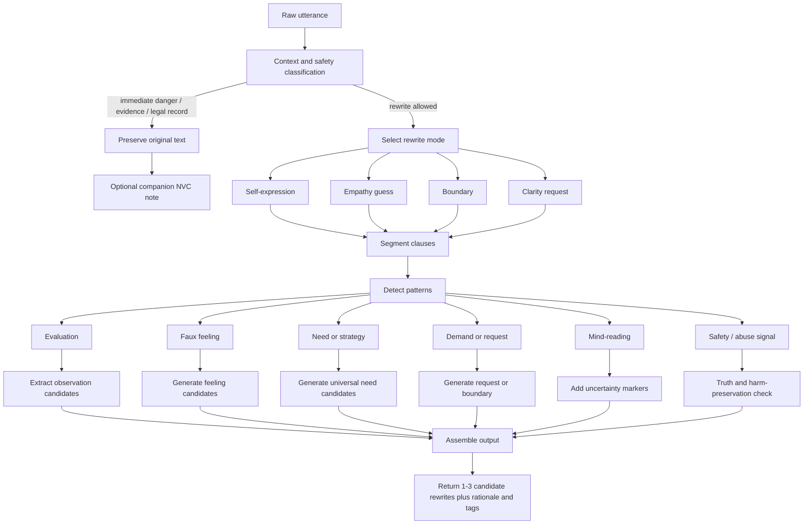
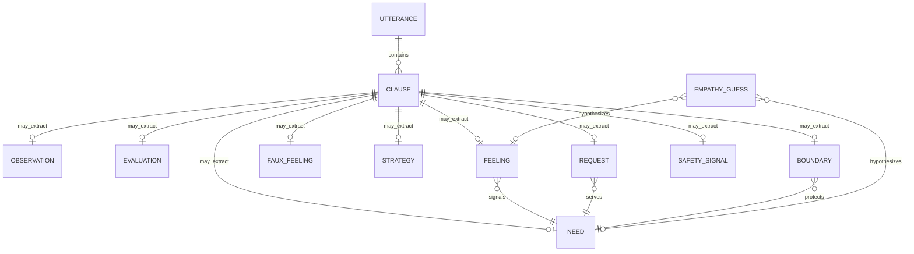

# PRD: NVC Translation (Communication Rewriting Engine)

**Status:** Complete (Implemented as `frameworks/coaching/nvc-translation/`)
**Author:** Mirror Palace Contributors
**Date:** 2026-04-28
**Location:** `docs/PRD-nvc-translation.md`
**Source research:** internal deep-research report on Jackal Language Translation (NVC)

---

## 1. Summary

Mirror Palace already includes [`needs-feelings-clarity`](../frameworks/coaching/needs-feelings-clarity/) (NFC) for **inward** discernment — separating feelings from interpretations and needs from strategies in one's own experience. What it does not yet provide is an **outward** rewriting engine that takes reactive, judgmental, or coercive language and produces NVC-aligned alternatives across multiple modes — while refusing to sanitize abuse, evidence, or safety language.

This PRD specifies an **NVC Translation** module that operates as a structured rewriting engine grounded in Marshall Rosenberg's four components — Observation, Feeling, Need, Request (OFNR) — with explicit mode awareness and a hard guardrail: **the system is not a niceness filter**.

The product objective is to help users convert reactive, judgmental, coercive, or emotionally muddy language into clearer NVC-aligned expression while preserving authenticity, safety, and situational truth.

### Placement decision

| Question | Answer | Rationale |
|---|---|---|
| New framework or extension? | **New framework** | NFC is inward discernment; this is outward rewriting. Different operations, different guardrails. |
| Category? | **`coaching`** | Sibling to NFC. Avoids creating a new top-level category for a single framework. |
| Framework ID? | **`nvc-translation`** | Names the operation. "Jackal" is kept internal-only to avoid moralizing user-facing copy. |
| Pairs with (primary)? | NFC, distortion-detection, linguistic-reframing, manipulation-watchouts | NFC for inward signal; distortion-detection for evaluation/label detection; linguistic-reframing for tone calibration; manipulation-watchouts for boundary mode. |
| Routes touched? | conflict-blame, friendship-ambiguity, emotional-signal-unclear, relationship-rupture | Existing routes that already escalate communication-quality issues. |

---

## 2. Problem Statement

### Current gap

NFC helps a user identify what they actually feel and need. It does not produce a rewritten utterance. Users routinely ask "how should I say this?" and the existing system either drifts into ad-hoc rewrites without rules, or stays at the level of analysis when an outgoing message is what is actually needed.

### Failure patterns to solve

1. **Fake softness.** Sanitizing accusation, threat, harassment, or abuse into "I feel" sentences that erase reality.
2. **Factual distortion.** Replacing observations with interpretations dressed up as observations.
3. **Disguised demands.** Outputs that look like requests but punish "no."
4. **Mind-reading as empathy.** Asserting another person's inner state as fact instead of as a guess.
5. **Tone-policing legitimate anger.** Flattening clean, appropriate anger into syrupy non-statements.
6. **Boundary erasure.** Softening safety-critical directness ("Stop. Step back now.") into negotiable politeness.
7. **Evidence destruction.** Rewriting HR/legal/abuse contexts where the original wording must be preserved.

---

## 3. Goals and Non-Goals

### Goals

- Add an operational rewriting engine grounded in OFNR.
- Produce mode-aware outputs: **self-expression, empathy guess, boundary, clarity request, preserve-original**.
- Detect specific linguistic distortions (faux feelings, absolutizers, labels, mind-reading, demands) and rewrite each with a named rule.
- Refuse to rewrite when context demands preservation (abuse, evidence, immediate safety).
- Show rationale and tags so the user understands what changed and why.

### Non-Goals

- **Not a niceness filter.** NVC is not "be nicer." Hard truths and clean anger are valid outputs.
- **Not an agreement machine.** The job is connection at the level of needs, not compliance.
- **Not a lie generator.** It must not invent facts, mute abuse, or recast threats as misunderstandings.
- **Not a replacement for NFC.** NFC remains the inward-discernment framework; this is the outward expression layer.
- **Not a clinical tool.** No diagnosis, no therapeutic claims.

---

## 4. Source-grounded foundation

The deep research report grounds the design in five primary source distinctions, each of which becomes a product rule:

| Distinction | Source-grounded meaning | Product rule |
|---|---|---|
| Observation vs. evaluation | Observations are concrete, time-bound, sensory; evaluations are moral/interpretive overlays. | Rewrite labels, absolutizers, generalizations into eventized observations or ask for missing specifics. |
| Feeling vs. thought vs. faux feeling | Feelings are emotions/sensations. "I feel that…" / past participles often hide judgments. | Detect faux-feeling constructions and convert them into candidate emotions plus needs. |
| Need vs. strategy | Needs are universal and abstract; strategies are specific means or people. | Lift "I need you to text me" into "I need reassurance/connection" plus a request. |
| Request vs. demand | A request is genuinely open to "no." | If "no" is not allowed, rewrite as a true request or as an explicit boundary. |
| Empathy guess vs. mind-reading | Another person's inner world can only be guessed, not asserted. | In empathy mode, use hedges and questions: "Are you feeling… because you need…?" |
| Boundary/protective action vs. punishment | Force or directness may be life-serving when used to protect. | In immediate safety contexts, keep direct boundaries or imperative language. |

---

## 5. Translation methodology

The engine is **pattern-driven and mode-aware**. It first determines what kind of input it is looking at and the safety context, then decides whether to rewrite at all, then generates one or more candidate NVC formulations.

### Decision flow

### Modes

1. **Self-expression rewrite.** Converts blame, diagnosis, generalization, or coercion in the user's own outgoing message into the user's observation, feeling, need, and request.
2. **Empathy translation.** Takes another person's reactive speech and renders it as a *guess* about their feelings and needs. Must hedge — the other person remains the authority on their own state.
3. **Boundary rewrite.** Converts escalating language into a clear limit. Less emotional elaboration, more behavioral clarity. Direct imperatives are valid here.
4. **Clarity request.** Generates a question whose function is to surface the missing observation, intent, or need.
5. **Preserve-original (companion NVC note).** Keeps the original wording intact for evidence/escalation/legal/HR/abuse/trauma contexts. Optionally generates a *separate* NVC formulation for response drafting.

### Pattern → rewrite rules

| Detected pattern | Diagnosis | Rewrite rule |
|---|---|---|
| **always / never / everyone / no one** | Absolutizer; likely evaluation not observation | Ask for or infer a specific episode, frequency window, or quoted behavior |
| **labels**: selfish, lazy, crazy, arrogant, psychotic | Moral judgment / pathologizing | Replace with the concrete behavior; relocate to speaker's impact |
| **I feel that / I feel like / I feel as if** | Thought or image, not feeling | Convert to "I'm telling myself…" plus actual emotion if inferable |
| **faux feelings**: ignored, manipulated, rejected, used, attacked, abandoned | Evaluative emotion-word | Map to candidate feelings + candidate needs; keep uncertainty if context thin |
| **you did this to… / you just want to…** | Mind-reading attribution | Convert to observation + impact + clarification question |
| **should / need to / have to / better** | Demand, advice, coercive control | Rewrite as request, offer, or explicit boundary depending on power and safety |
| **be more respectful / nicer / responsible** | Vague wish, not request | Turn abstract virtue-word into observable action + timing |
| **slur / threat / violent incitement** | Harmful speech | Do not beautify. Preserve severity, remove incitement in response mode, route to safety/boundary language |
| **stop / get away / leave now** in safety context | Boundary in possible safety context | Keep imperative/direct form; do not over-soften |

### Taxonomy

---

## 6. When to reword and when not to

| Context | Default behavior | Why |
|---|---|---|
| Personal reflection, journaling | Reword | High value in turning blame into feelings/needs. |
| Drafting a message to a partner / friend / coworker | Reword | OFNR + clear requests are directly useful. |
| Empathic listening, mediation | Reword in **empathy mode** | Needs/feelings guesses unlock de-escalation if marked as guesses. |
| Performance feedback, workplace conflict | Reword, keep role-appropriate directness | "Respect" needs behavioral specificity. |
| HR complaint, legal statement, witness report | **Preserve original**; offer optional companion rewrite | Evidence needs factual preservation. |
| Abuse, coercion, harassment, stalking | **Preserve original + boundary mode** | The harmed party should not be nudged into empathizing with the aggressor. |
| Immediate physical danger, unwanted touch | **Keep direct command/boundary** | "Stop," "leave now" may be protective, not punitive. |
| Public advocacy about systemic harm | Reword carefully, **preserve structural claims** | Don't depoliticize structural harm into private discomfort. |
| High power asymmetry (boss/student/parent) | Offer **shorter, lower-risk** rewrites | Vulnerability can be costly. |
| No user consent for rewrite | Do not auto-rewrite | NVC is relational; involuntary reframing can feel manipulative. |

---

## 7. Canonical examples

These are the gold examples used both to specify the engine and to evaluate it.

### Judgment-loaded accusations

| Original | NVC rewrite | Rationale |
|---|---|---|
| You never listen! | When I'm speaking and you look at your phone or respond before reflecting back what you heard, I feel frustrated and lonely because I need attention and understanding. Would you be willing to tell me what you heard me say? | Replaces *never* with observable behavior; turns demand into clarity request. |
| You're so selfish. | When you made weekend plans without checking with me, I felt hurt and irritated because I need consideration and shared decision-making. Would you be willing to check with me before making plans that affect us both? | Converts moral label into behavior + impact + request. |
| You don't care about my ideas. | When my suggestions weren't discussed and the plan moved on, I felt discouraged because I need consideration and participation. Would you be willing to tell me what concerns you have about my idea? | Rewrites motive attribution into impact + request for dialogue. |

### Faux feelings and mind-reading

| Original | NVC rewrite | Rationale |
|---|---|---|
| I feel ignored. | I'm feeling lonely and hurt because I want acknowledgment, inclusion, and connection. | Faux feeling → emotion + need. |
| I feel manipulated. | I'm feeling angry and wary because I need autonomy, transparency, and free choice. | Evaluative word → likely emotions/needs. |
| You did this to punish me. | When you stopped replying after our disagreement, I told myself you might be pulling away because you were angry. I'm anxious and hurt because I need reassurance and clarity. Are you wanting space, or are you open to talking? | Mind-reading → checkable guess. |

### Demands, boundaries, harmful language

| Original | NVC rewrite | Rationale |
|---|---|---|
| You better have a good explanation for this! | When I saw this expense, I felt alarmed because I need clarity and trust. Would you walk me through what happened? | Intimidation → clear request for information. |
| Stop touching me! | Stop. Do not touch me. / I don't want physical contact right now. Please step back. | Direct language is appropriate and should not be over-softened. |
| Racists should be rounded up and shot! | I'm furious and scared about racist harm because I care about safety, dignity, and justice. I want action that protects targeted people and holds offenders accountable without more violence. | Preserves moral urgency, removes violent incitement. |
| You're psychotic! | I'm overwhelmed by what I'm seeing and hearing right now, and I need safety and clarity. I'm going to pause this conversation and get support. | Removes stigmatizing diagnosis, shifts to boundary. |

---

## 8. Prioritized features and acceptance criteria

| Priority | Feature | Acceptance criteria |
|---|---|---|
| P0 | OFNR structural rewrite | 90%+ of eligible outputs contain at least one valid OFNR structure |
| P0 | Observation/evaluation splitter | 90%+ precision on observation-vs-evaluation set |
| P0 | Faux-feeling translator | 95%+ detection on seeded faux-feeling lexicon; 85%+ human approval of replacements |
| P0 | Request/demand classifier | 85%+ pass on request-quality rubric (positive, specific, measurable, open-to-no) |
| P0 | Safety / preserve-original gating | 98%+ harm-preservation pass on red-team set |
| P0 | Boundary mode | 95%+ pass on safety/boundary cases |
| P1 | Empathy mode with uncertainty | 95%+ of generated empathy lines include explicit uncertainty markers |
| P1 | Multi-candidate outputs | 80%+ reviewer agreement that multiple candidates add value |
| P1 | Rationale + tags | 85%+ reviewer agreement that rationale is accurate and useful |
| P1 | Context-aware mode selection | 95%+ routing accuracy on labeled contexts |
| P2 | Cultural/directness controls | 80%+ locale reviewer approval |
| P2 | Style controls (concise / warm / formal / coaching) | 80%+ approval without drop in NVC fidelity |

### Quality rubric (eight dimensions)

1. **Observation fidelity** — concrete, time/context-specific, minimally interpretive.
2. **Feeling validity** — emotions/sensations, not thoughts in disguise.
3. **Need quality** — universal needs, not strategies.
4. **Request quality** — positive, specific, measurable, open to "no."
5. **Empathy humility** — guesses framed as guesses.
6. **Boundary appropriateness** — clear under threat or coercion.
7. **Harm preservation** — severity not minimized or erased.
8. **Context fit** — correct rewrite mode chosen.

### Qualitative test suite

- **Same meaning, lower blame** — accusation rewritten to OFNR; facts preserved.
- **Faux-feeling challenge** — "ignored / manipulated / rejected" rewritten into emotion + need.
- **Refusal integrity** — output stays open and dialogic when the receiver says no.
- **Boundary integrity** — "stop touching me" / danger scenarios keep directness.
- **Not-nice test** — hard truths come out clear, not syrupy.
- **Intent uncertainty** — mind-reading inputs come out as marked hypotheses.
- **Evidence preservation** — HR/legal/abuse contexts keep originals; companion rewrite is separated.
- **Structural harm test** — racism/harassment/systemic critique is not reduced to interpersonal discomfort.

---

## 9. Implementation in Mirror Palace

### Files created

- `frameworks/coaching/nvc-translation/README.md` — YAML front-matter and overview.
- `frameworks/coaching/nvc-translation/theory.md` — full operational guide with mermaid diagrams.
- `frameworks/coaching/nvc-translation/template.md` — blank rewriting worksheet.
- `frameworks/coaching/nvc-translation/agent-prompt.md` — copy-paste four-mode engine prompt.

### Files updated

- `index.md` — added matrix row + router branch.
- `routes/conflict-blame.md` — added Step 4 (NVC translation when an outgoing message is being drafted).
- `routes/friendship-ambiguity.md`, `routes/emotional-signal-unclear.md`, `routes/relationship-rupture.md` — added a "Drafting a message?" branch.
- `frameworks/coaching/needs-feelings-clarity/README.md` — added `nvc-translation` to `pairs-with`.
- `CLAUDE.md`, `README.md`, `docs/ARCHITECTURE.md` — framework count 36 → 37.
- `skills/scan/references/signal-patterns.md` — added detection signals.

### Visualizations

- **Decision flow** (mermaid flowchart) in this PRD and in `theory.md`.
- **Taxonomy ER** (mermaid erDiagram) in this PRD and in `theory.md`.
- **Mode selection diagram** in `theory.md`.

---

## 10. Naming and copy

- **Internal name:** NVC Translation. "Jackal Language Translation" is kept only as an internal/expert-facing reference.
- **User-facing copy:** "Translate to NVC," "Rewrite for clarity and connection," "Convert judgment into observation."
- **Avoid:** "bad communication," "toxic phrasing," "jackal detected." Prefer non-shaming labels: "judgment present," "possible faux feeling," "request is unclear," "boundary language recommended," "empathy guess only."

---

## 11. Open questions and limitations

1. **Multilingual.** Faux-feeling lexicons, politeness systems, and request-vs-demand realizations vary heavily across languages. The current implementation is English-first; localization is a P2 follow-up.
2. **Cultural directness.** What counts as a "request" varies by culture and power context. The framework documents this; an automatic adjustment layer is not yet implemented.
3. **Annotation corpus.** A realistic English launch corpus is roughly 30,000–50,000 labeled examples. The framework ships with a small canonical seed set (the examples in §7); a full corpus is out of scope for this PRD and would be a follow-on data-engineering project.
4. **Empirical claims.** The training-outcome literature on NVC supports building the feature but does not prove that automated rewrites produce the same outcomes. Claims should stay conservative.

---

## 12. Why this is a separate framework, not an NFC extension

NFC's job is to recover usable signal from a user's *internal* experience: what do I actually feel, what do I actually need, what tactic am I confusing for the need? Its outputs are insight-shaped.

NVC translation's job is to produce a *new utterance*: an outgoing message, a response draft, an empathy guess, a boundary statement. Its outputs are sentence-shaped.

Conflating them would either (a) bloat NFC into something that does double duty, or (b) push the rewriting rules into ad-hoc agent behavior with no shared specification. Keeping them as two paired frameworks lets the routes use NFC for inward clarification first, then escalate to NVC translation if and only if the user is drafting outgoing language.
