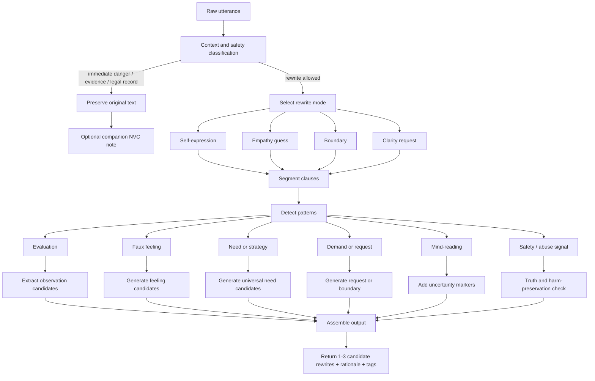
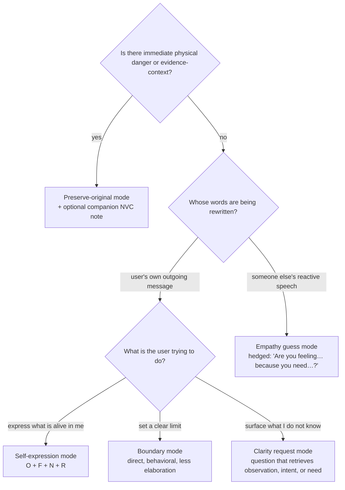
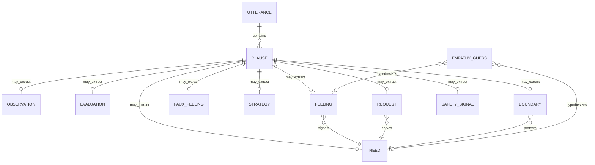

# NVC Translation

## Core Concept

Nonviolent Communication (NVC), developed by Marshall Rosenberg, is a practice of honest expression and empathic receiving organized around four components: **observation, feeling, need, and request** (OFNR). The four components matter less individually than the four *distinctions* between them: observation versus evaluation, feeling versus thought, need versus strategy, and request versus demand. A communication problem usually shows up as a confusion at one or more of these joints.

This framework is a structured rewriting engine that takes a piece of reactive, judgmental, coercive, or emotionally muddy language and produces NVC-aligned alternatives across multiple modes. It is **not a niceness filter**. NVC is not about being nice, erasing conflict, or translating abuse into politeness. The product test is not "does this sound softer" but "does this preserve reality, agency, and safety while improving connection?"

The framework is the outward-expression companion to [Needs & Feelings Clarity](../needs-feelings-clarity/) (NFC). NFC's job is to recover usable signal from internal experience; its outputs are insight-shaped. NVC Translation's job is to produce a new utterance from that signal; its outputs are sentence-shaped. The two are paired: in most cases NFC runs first, and NVC Translation only fires when the user is actually drafting outgoing language.

## Key Principles

### Principle 1 — Diagnosis before rewrite

The two worst failure modes — fake softness and factual distortion — both arise when the engine starts generating before it has classified what kind of input it is looking at. Before any rewriting, the engine asks: what context is this (personal reflection, draft message, mediation, HR record, immediate safety event)? What clauses are present (observation, evaluation, faux feeling, demand)? What rewrite mode does the situation actually call for? Only then does it generate.

This is why the framework specifies five modes (self-expression, empathy guess, boundary, clarity request, preserve-original) rather than one universal "make it nicer" operation. The modes are the diagnostic output: choosing the right mode is most of the work.

### Principle 2 — Observations are concrete, time-bound, and minimally interpretive

An observation is what a camera could record. "When you revised the plan without asking me." "When the report was late on Monday and Wednesday." Evaluations and labels — "you're a control freak," "you never listen," "you're being selfish" — are moral or interpretive overlays attached to those events. They feel descriptive but are actually conclusions.

The rewrite move is to pull the underlying behavior out from under the label and place it back in time. "You never listen" becomes "When I was speaking and you looked at your phone." "You're so selfish" becomes "When you made weekend plans without checking with me." If the underlying behavior cannot be recovered, that is itself diagnostic — the user may be working from interpretation alone, and the right next move is a clarity request rather than a rewrite.

### Principle 3 — Feelings are emotions and sensations, not thoughts in disguise

Many surface-grammar feelings are not feelings. The constructions **"I feel that…," "I feel like…," "I feel as if…"** almost always introduce a thought, an image, or a judgment, not an emotion. And a class of words usually called **faux feelings** — *ignored, manipulated, rejected, abandoned, attacked, dismissed, used, betrayed, invalidated* — are evaluations of what the other person did, not names of the speaker's emotional state.

The rewrite move is to convert the thought-report or faux feeling into a candidate emotion plus the candidate need it points to. "I feel ignored" → "I'm feeling lonely and hurt because I want acknowledgment, inclusion, and connection." "I feel manipulated" → "I'm feeling angry and wary because I need autonomy, transparency, and free choice." The mapping is probabilistic, not absolute. If context is thin, the engine offers candidates rather than asserting one.

### Principle 4 — Needs are universal and abstract; strategies are specific

A need is a life-serving condition shared by all humans: connection, autonomy, safety, recognition, belonging, contribution, rest, fairness, meaning. A strategy is one specific way someone hopes to meet a need: "you texting me back," "him apologizing," "her choosing me," "them being on time."

The confusion shows up as "I need you to text me." That is a strategy — a specific tactic for meeting an underlying need (most likely reassurance, connection, or clarity). The rewrite separates the layer: "I need reassurance and connection. Would you be willing to send a quick message when you'll be late so I'm not guessing?" Once the need is named at the right level of abstraction, the strategy becomes negotiable; multiple strategies could serve the same need.

### Principle 5 — A request is genuinely open to "no"

The behavioral test for a request: if the receiver says "no," does the sender remain in dialogue, or does pressure begin? If "no" is not allowed, the output is a demand, no matter how politely it is phrased. Demands disguised as requests are one of the most common failure modes of polished but hollow NVC outputs.

A real request is **positive** (what to do, not what to stop), **specific** (an action, not a virtue word), **measurable** (you can tell whether it happened), **timely** (a window, not "someday"), and **open**. Three functional types: action, feedback, and clarity. "Would you tell me what you heard me say?" is a clarity request. "Would you send me a message by noon if a deadline will slip?" is an action request. "How does this land for you?" is a feedback request.

### Principle 6 — Empathy about another person is a guess, not an assertion

The other person remains the authority on their own inner state. In empathy mode the engine must hedge — "Are you feeling…? Are you needing…?" — not assert. Mind-reading dressed up as compassion is one of the more insidious failure modes; it can feel warm and still be wrong, and the wrongness is not visible because the form looks like care.

The rewrite move converts mind-reading constructions ("you did this to punish me," "you just want to control me") into checkable hypotheses: "When you stopped replying after our disagreement, I told myself you might be pulling away because you were angry. Are you wanting space, or are you open to talking?" The hypothesis is named *as* a hypothesis.

### Principle 7 — Boundaries and protective directness are valid; punishment is not

NVC is not pacifism. Force or directness can be life-serving when used to protect rather than punish. In immediate-safety contexts ("Stop. Step back now." "Do not touch me.") the engine preserves direct language; over-softening is a product failure. The same goes for power-asymmetry contexts where vulnerability is costly — short, low-risk rewrites beat full emotional disclosure.

The test that distinguishes a boundary from a punishment: does the consequence protect the speaker, or punish the receiver? "If we can't agree on this, I'll need to make different living arrangements" is a boundary — it describes what the speaker will do to protect their needs. "If you don't agree, you'll be sorry" is a punishment.

## How It Works

The engine runs as a sequence: classify, select mode, segment, detect patterns, rewrite, assemble.

### Mode selection

### Pattern → rewrite rules

| Detected pattern | Diagnosis | Rewrite rule | Skeleton |
|---|---|---|---|
| **always / never / everyone / no one** | Absolutizer; likely evaluation, not observation | Ask for or infer a specific episode or frequency window | "When X happened [twice this week / in today's meeting]…" |
| **Labels**: selfish, lazy, crazy, arrogant, psychotic, control freak | Moral judgment / pathologizing | Replace with the concrete behavior; relocate to speaker's impact | "When you revised the plan without asking me…" |
| **"I feel that / like / as if"** | Thought or image, not feeling | Convert to "I'm telling myself…" + actual emotion if inferable | "I'm telling myself you don't care, and I'm hurt." |
| **Faux feelings**: ignored, manipulated, rejected, abandoned, attacked, used, dismissed, betrayed, invalidated | Evaluative emotion-word | Map to candidate feelings + candidate needs; keep uncertainty if context is thin | "I'm lonely and frustrated because I want acknowledgment and inclusion." |
| **"You did this to… / you just want to…"** | Mind-reading attribution of intent | Convert to observation + impact + clarification question | "When X happened, I told myself Y. Is that what was going on?" |
| **should / need to / have to / better** | Demand, advice, or coercive control | Rewrite as request, offer, or explicit boundary depending on power and safety | "Would you be willing to…?" / "If not, I will…" |
| **"Be more respectful / nicer / responsible"** | Vague wish, not request | Turn abstract virtue-word into observable action and timing | "Would you send the update by noon if the deadline slips?" |
| **Slur / threat / violent incitement** | Harmful speech | Do not beautify. Preserve severity, remove incitement, route to safety/boundary language | "I'm furious about X and want protective, nonviolent action." |
| **"Stop touching me / get away / leave now"** | Boundary in possible safety context | Keep imperative/direct form. Do not over-soften. | "Stop. Step back now." |
| **Noncompliance consequence** | Could be a demand or a boundary | Test whether the outcome punishes the other or protects the speaker | "If we can't agree on this, I'll need to…" |

### Taxonomy

### Step-by-step procedure

1. **Classify context.** Personal reflection, draft message, mediation, performance feedback, HR/legal/evidence, abuse/harassment/safety, public advocacy, high power asymmetry, or unknown. If context is evidence or immediate-safety, choose preserve-original mode and stop.
2. **Get consent.** If the user has not asked for a rewrite, do not auto-rewrite. NVC is relational; involuntary reframing can feel manipulative.
3. **Select mode.** Self-expression, empathy guess, boundary, clarity request, or preserve-original.
4. **Segment the utterance** into clauses.
5. **Detect patterns** in each clause: evaluation, faux feeling, need vs. strategy, request vs. demand, mind-reading, safety/abuse signal.
6. **Apply pattern rules** to generate observation candidates, feeling candidates, universal-need candidates, request or boundary candidates, uncertainty markers, and harm-preservation flags.
7. **Assemble** into 1–3 rewrite candidates. Include rationale and tags so the user sees what changed.
8. **Run the integrity checks** before returning: refusal integrity ("would this output remain dialogic if the receiver says no?"), boundary integrity ("does this preserve directness in safety contexts?"), harm preservation ("does this erase severity?"), uncertainty preservation ("are empathy guesses still hedged?"), and the not-nice test ("am I producing fake softness?").
9. **Update status** if relevant: people, decisions, domains.

### Useful need clusters

The engine draws need-language from a small, stable inventory:

- **physical regulation** — rest, food, sleep, safety from harm
- **safety / steadiness** — predictability, protection, trust
- **connection / belonging** — closeness, inclusion, acknowledgment, intimacy
- **autonomy / agency** — choice, freedom, self-direction
- **recognition / mattering** — being seen, being valued, contribution acknowledged
- **meaning / direction** — purpose, alignment with values
- **growth / competence** — learning, mastery, challenge
- **play / aliveness** — fun, spontaneity, lightness
- **integrity / alignment** — honesty, congruence between actions and values
- **fairness / justice** — equity, accountability, dignity

### Useful feeling families

- **activation / threat** — afraid, anxious, alarmed, on edge
- **loss / grief** — sad, lonely, heartbroken, disappointed
- **frustration / boundary pressure** — angry, irritated, resentful, tense
- **disconnection / loneliness** — distant, unseen, unheard
- **shame / diminishment** — embarrassed, exposed, small
- **fulfillment / joy** — glad, grateful, satisfied, alive
- **curiosity / orientation** — interested, open, attentive

## Applied As

- **In drafting messages**: a user types a reactive draft after a hard conversation; the engine produces 1–3 NVC-aligned alternatives plus a tag list ("absolutizer present, request unclear, boundary recommended").
- **In mediation or empathic listening**: the engine takes another person's reactive speech and returns a hedged empathy guess that the user can offer ("Are you feeling overwhelmed because you'd like more breathing room?").
- **In hard-conversation prep**: the engine helps someone preparing for a confrontation produce a clean opener, a real request, and a fallback boundary in case the request is refused.
- **In journaling**: faux-feeling-heavy entries get translated into emotion + need pairs that the user can review and revise.
- **In HR / legal / abuse contexts**: the engine refuses to rewrite and instead preserves the original wording; if the user asks for a separate response draft, that is generated as a clearly-labeled companion document.

## Common Misapplications

- **Using it as a niceness filter.** Producing softer-sounding text that has erased reality, severity, or accountability. The not-nice test is hardcoded into the agent prompt for this reason.
- **Generating "requests" that punish "no."** "Would you be willing to apologize?" with the implicit threat that refusal will end the relationship is still a demand.
- **Asserting another person's inner state in empathy mode.** "You're angry because I didn't text" is not empathy; it is a claim. Empathy mode must hedge.
- **Rewriting someone else's words to make them more agreeable.** This framework rewrites *the user's own outgoing language* (self-expression mode) or generates *guesses* about the other's state (empathy mode). It does not rewrite what someone else said.
- **Tone-policing legitimate anger.** Clean anger paired with a clear request or boundary is valid NVC output. The engine does not flatten it.
- **Replacing an obvious boundary or exit with more analysis.** If the user is already clear that they need to leave, no rewrite is needed.
- **Translating abuse into "I feel" sentences.** Threats, harassment, and coercion get the preserve-original treatment; the harmed party should not be nudged into empathizing with the aggressor.
- **Using "jackal" as user-facing language.** It can shame. Internal-only.

## Integration Points

This framework pairs especially well with:

- **[Needs & Feelings Clarity](../needs-feelings-clarity/)** — NFC runs first when the user does not yet know what they actually feel and need. NVC Translation only fires when there is signal to express. In most flows the order is NFC → NVC Translation.
- **[Distortion Detection](../../cognitive-therapy/distortion-detection/)** — labels, absolutizers, and mind-reading are cognitive distortions in CBT terms. Distortion Detection helps the user *see* the pattern; NVC Translation helps them *rewrite* the resulting utterance.
- **[Linguistic Reframing](../../cognitive-therapy/linguistic-reframing/)** — handles tone calibration and presupposition shifts. NVC Translation is more constrained: OFNR-shaped output.
- **[Manipulation Watchouts](../../influence-defense/manipulation-watchouts/)** — when the *receiver* is using pressure, scarcity, or coercion, the right output is usually a boundary, not an empathic rewrite. Manipulation Watchouts gates the mode selection.
- **[Stories vs Facts](../stories-vs-facts/)** — separates narrative from event. The "what would a camera have recorded" move feeds directly into the observation extraction step.
- **[Family Systems Differentiation](../../trauma-recovery/family-systems-differentiation/)** — when "I need you to" is actually fused dependence on a specific person, differentiation work is needed before the NVC rewrite is meaningful.

It usually comes after NFC and before action. NFC produces clean signal; NVC Translation produces the sentence; the action is sending it (or choosing not to).

## When NOT to use this framework

- **Immediate physical danger.** Direct boundary language is the priority. Do not rewrite "Stop. Get away from me." into anything.
- **Evidence contexts** (HR complaint, legal record, witness report, medical chart). Preserve the original wording. Sanitization is a product failure.
- **Without consent.** If the user is venting and has not asked for a rewrite, do not produce one. Reflect, don't reframe.
- **When clean anger is appropriate.** Anger paired with a real request or boundary is valid NVC. Flattening it is misuse.
- **When an obvious decision or exit is being delayed by more analysis.** The framework should not become a way to avoid action.
- **As a substitute for repair.** Sending a perfectly-worded NVC message does not, by itself, repair a rupture. The receiver still has to be willing to receive.

## Quality rubric

A rewrite passes if it satisfies all eight:

1. **Observation fidelity** — concrete, time-bound, minimally interpretive.
2. **Feeling validity** — emotions/sensations, not thoughts in disguise.
3. **Need quality** — universal needs, not strategies.
4. **Request quality** — positive, specific, measurable, timely, open to "no."
5. **Empathy humility** — guesses framed as guesses.
6. **Boundary appropriateness** — clear under threat or coercion.
7. **Harm preservation** — severity not minimized or erased.
8. **Context fit** — correct rewrite mode chosen for context.

If any dimension fails, return to the pattern-detection step rather than ship a soft-but-wrong rewrite.
