# Framework Index

The master routing table. Use this to find the right framework for a situation, and to know what data to update when a framework fires.

---

## Situation Router

```mermaid
graph TD
    START{What's happening?} --> STUCK[Stuck on a decision]
    START --> DESIGN[Designing a system or product]
    START --> PATTERN[Noticing a behavioral pattern]
    START --> LEARN[Want to learn from experience]
    START --> COACH[Coaching self or others]
    START --> HEAL[Processing past patterns]
    START --> BODY[Body or nervous system signal]
    START --> INFLUENCE[Something feels off in an interaction]
    START --> IDENTITY[Questions about who I am]

    STUCK --> Q1{Is it reversible?}
    Q1 -->|Check| RC[reversibility-classification]
    Q1 -->|Overthinking| RM[regret-minimization]
    STUCK --> Q2{Multiple competing options?}
    Q2 --> NS[north-star-test]
    STUCK --> Q3{Career/purpose alignment?}
    Q3 --> IK[ikigai-diagnostic]

    DESIGN --> Q4{What problem does it solve?}
    Q4 --> JTBD[jobs-to-be-done]
    DESIGN --> Q5{Will people use it?}
    Q5 --> BE[behavior-equation]
    Q5 --> HL[habit-loop-design]
    DESIGN --> Q6{Needs ADHD support?}
    Q6 --> ADHD[adhd-design-rules]
    Q6 --> EF[executive-function-model]
    DESIGN --> Q7{How to measure?}
    Q7 --> NS2[north-star-test]

    PATTERN --> Q8{Cognitive distortion?}
    Q8 --> DD[distortion-detection]
    PATTERN --> Q9{Recurring failure?}
    Q9 --> FM[failure-modes]
    PATTERN --> Q10{Childhood origin?}
    Q10 --> FF[four-f-survival-types]
    Q10 --> CEN[childhood-emotional-neglect]
    Q10 --> EIP[emotionally-immature-parents]

    LEARN --> CLL[closed-loop-learning]

    COACH --> SSC[structured-self-coaching]
    COACH --> SVF[stories-vs-facts]
    COACH --> DS[developmental-stages]

    HEAL --> FF2[four-f-survival-types]
    HEAL --> FSD[family-systems-differentiation]
    HEAL --> FW[five-wounds]
    HEAL --> PC[psychological-contracts]

    BODY --> SR[subconscious-repatterning]
    BODY --> EA[embodied-awareness]

    INFLUENCE --> BSR[behavioral-signal-reading]
    INFLUENCE --> LPA[leverage-point-awareness]
    INFLUENCE --> MW[manipulation-watchouts]

    IDENTITY --> SIC[self-image-cybernetics]
    IDENTITY --> TP[teleological-psychology]
    IDENTITY --> RSI[rational-self-interest]
    IDENTITY --> BF[big-five]
    IDENTITY --> EN[enneagram]
    IDENTITY --> MB[mbti]

    START --> PRACTICE[Building an integrated practice]
    PRACTICE --> Q11{Need rational framework?}
    Q11 --> RY[rational-yoga]
    PRACTICE --> Q12{Body-mind connection?}
    Q12 --> EA2[embodied-awareness]
    Q12 --> RY2[rational-yoga]
```

---

## Full Framework Matrix

| ID | Category | Framework | Use When | Update When Triggered | Pairs With |
|----|----------|-----------|----------|----------------------|------------|
| `CF` | Epistemology | [Concept Formation](frameworks/epistemology/concept-formation/) | Reasoning feels ungrounded, concepts are vague, noise is overwhelming signal | — | mirror-cognitive-architecture, information-compression |
| `MCA` | Epistemology | [MIRROR Cognitive Architecture](frameworks/epistemology/mirror-cognitive-architecture/) | Designing agent cognition, structuring persistent internal narratives | — | concept-formation, information-compression |
| `IC` | Epistemology | [Information Compression](frameworks/epistemology/information-compression/) | Context is getting long, need to decide what to keep vs discard | — | concept-formation, mirror-cognitive-architecture |
| `RC` | Decision-Making | [Reversibility Classification](frameworks/decision-making/reversibility-classification/) | Any decision — first classify it before analyzing | `status/decisions/` | regret-minimization, north-star-test |
| `RM` | Decision-Making | [Regret Minimization](frameworks/decision-making/regret-minimization/) | High-stakes life choices, paralysis on big moves | `status/decisions/` | reversibility-classification, ikigai-diagnostic |
| `NST` | Decision-Making | [North Star Test](frameworks/decision-making/north-star-test/) | Evaluating features, actions, or priorities — what matters most? | `status/domains/`, `status/decisions/` | behavior-equation, adhd-design-rules |
| `IKD` | Decision-Making | [Ikigai Diagnostic](frameworks/decision-making/ikigai-diagnostic/) | Career/purpose misalignment, feeling lost about direction | `status/domains/career-work.md`, `status/decisions/` | regret-minimization, systems-over-goals |
| `JTBD` | Behavioral Psych | [Jobs to Be Done](frameworks/behavioral-psychology/jobs-to-be-done/) | Designing products, understanding why people do things | — | behavior-equation, north-star-test |
| `BEQ` | Behavioral Psych | [Behavior Equation](frameworks/behavioral-psychology/behavior-equation/) | Building habits, designing interventions, things aren't getting done | `status/domains/` | habit-loop-design, adhd-design-rules |
| `HLD` | Behavioral Psych | [Habit Loop Design](frameworks/behavioral-psychology/habit-loop-design/) | Creating new habits or breaking old ones | `status/domains/health-fitness.md` | behavior-equation, variable-reward-schedules |
| `VRS` | Behavioral Psych | [Variable Reward Schedules](frameworks/behavioral-psychology/variable-reward-schedules/) | Designing engagement systems, maintaining motivation | — | habit-loop-design, loss-aversion |
| `LA` | Behavioral Psych | [Loss Aversion](frameworks/behavioral-psychology/loss-aversion/) | Streak design, notification language, framing choices | — | variable-reward-schedules, distortion-detection |
| `IR` | Behavioral Psych | [Identity Reinforcement](frameworks/behavioral-psychology/identity-reinforcement/) | Connecting actions to stated values, building confidence | `status/domains/personal-growth-learning.md` | self-image-cybernetics, systems-over-goals |
| `DD` | Cognitive Therapy | [Distortion Detection](frameworks/cognitive-therapy/distortion-detection/) | Catastrophizing, all-or-nothing thinking, should-statements | `status/domains/`, `status/people/` | awareness-as-intervention, failure-modes |
| `LR` | Cognitive Therapy | [Linguistic Reframing](frameworks/cognitive-therapy/linguistic-reframing/) | User is stuck, needs perspective shift, communication design | — | distortion-detection, behavior-equation |
| `AAI` | Cognitive Therapy | [Awareness as Intervention](frameworks/cognitive-therapy/awareness-as-intervention/) | Pattern is recurring, naming it may be enough | `status/domains/` | distortion-detection, failure-modes |
| `EFM` | Executive Function | [Executive Function Model](frameworks/executive-function/executive-function-model/) | Understanding which cognitive function needs support | `status/domains/` | adhd-design-rules, time-blindness |
| `ADR` | Executive Function | [ADHD Design Rules](frameworks/executive-function/adhd-design-rules/) | Designing systems for real humans with executive function variance | — | executive-function-model, behavior-equation |
| `TB` | Executive Function | [Time Blindness](frameworks/executive-function/time-blindness/) | Scheduling, estimating duration, deadline language | `status/domains/career-work.md` | adhd-design-rules, executive-function-model |
| `CLL` | Continuous Learning | [Closed-Loop Learning](frameworks/continuous-learning/closed-loop-learning/) | Want to learn from experience, not just accumulate information | `status/domains/personal-growth-learning.md` | north-star-test, failure-modes |
| `SIC` | Self-Image | [Self-Image Cybernetics](frameworks/self-image/self-image-cybernetics/) | Self-concept is limiting behavior, identity doesn't match actions | `personality-assessments/`, `status/domains/personal-growth-learning.md` | teleological-psychology, identity-reinforcement |
| `TP` | Self-Image | [Teleological Psychology](frameworks/self-image/teleological-psychology/) | Examining hidden goals, belonging strategies, purpose narratives | `status/domains/`, `status/decisions/` | self-image-cybernetics, stories-vs-facts |
| `SOG` | Self-Image | [Systems Over Goals](frameworks/self-image/systems-over-goals/) | Building sustainable practices instead of chasing endpoints | `status/domains/` | identity-reinforcement, behavior-equation |
| `RSI` | Self-Image | [Rational Self-Interest](frameworks/self-image/rational-self-interest/) | Guilt about self-prioritization, values misalignment, living by default rather than choice | `status/domains/personal-growth-learning.md`, `status/domains/career-work.md`, `status/decisions/` | systems-over-goals, identity-reinforcement, north-star-test, ikigai-diagnostic |
| `4F` | Trauma Recovery | [Four-F Survival Types](frameworks/trauma-recovery/four-f-survival-types/) | Stress response feels disproportionate, flashback-like reactions | `status/domains/`, `status/people/` | childhood-emotional-neglect, five-wounds |
| `CEN` | Trauma Recovery | [Childhood Emotional Neglect](frameworks/trauma-recovery/childhood-emotional-neglect/) | Difficulty identifying needs, counter-dependence, emotional numbness | `status/people/`, `status/domains/partner-love.md` | four-f-survival-types, emotionally-immature-parents |
| `EIP` | Trauma Recovery | [Emotionally Immature Parents](frameworks/trauma-recovery/emotionally-immature-parents/) | Recognizing parent patterns, internalizer/externalizer dynamics | `status/people/`, `status/domains/family-friends.md` | childhood-emotional-neglect, family-systems-differentiation |
| `FSD` | Trauma Recovery | [Family Systems Differentiation](frameworks/trauma-recovery/family-systems-differentiation/) | Enmeshment, triangulation, multigenerational patterns | `status/people/`, `status/domains/family-friends.md` | emotionally-immature-parents, psychological-contracts |
| `EFT` | Trauma Recovery | [EFT Relationship Lens](frameworks/trauma-recovery/eft-relationship-lens/) | Repeating romantic conflict, pursue-withdraw dynamics, attachment-heavy rupture/repair questions | `status/people/`, `status/domains/partner-love.md`, `status/decisions/` | needs-feelings-clarity, psychological-contracts, family-systems-differentiation |
| `5W` | Trauma Recovery | [Five Wounds](frameworks/trauma-recovery/five-wounds/) | Core wound identification, mask patterns, body-pattern links | `status/domains/`, `personality-assessments/` | four-f-survival-types, self-image-cybernetics |
| `SSC` | Coaching | [Structured Self-Coaching](frameworks/coaching/structured-self-coaching/) | Weekly reflection, need structured growth practice | `status/domains/personal-growth-learning.md` | stories-vs-facts, closed-loop-learning |
| `SVF` | Coaching | [Stories vs Facts](frameworks/coaching/stories-vs-facts/) | Narrative is running the show, need to separate story from reality | `status/decisions/`, `status/domains/` | structured-self-coaching, distortion-detection |
| `DS` | Coaching | [Developmental Stages](frameworks/coaching/developmental-stages/) | Assessing readiness for challenge vs need for safety | `status/domains/personal-growth-learning.md` | structured-self-coaching, four-f-survival-types |
| `ACT` | Coaching | [Acceptance & Commitment Therapy](frameworks/coaching/acceptance-and-commitment-therapy/) | Fusion, avoidance, shame spirals, comparison, or overprocessing are blocking values-guided action | `status/domains/`, `status/people/`, `status/decisions/` | needs-feelings-clarity, stories-vs-facts, awareness-as-intervention, embodied-awareness |
| `NFC` | Coaching | [Needs & Feelings Clarity](frameworks/coaching/needs-feelings-clarity/) | Emotional language is muddy, accusation-heavy, or confused with strategy | `status/domains/`, `status/people/`, `status/decisions/` | structured-self-coaching, stories-vs-facts, awareness-as-intervention |
| `SIG` | Coaching | [Signal Processing](frameworks/coaching/signal-processing/) | Email, notifications, admin friction, or social/career inbound signals need interpretation and routing, not just triage | `status/domains/`, `status/people/`, `status/decisions/` | needs-feelings-clarity, acceptance-and-commitment-therapy, stories-vs-facts, failure-modes |
| `BSR` | Influence Defense | [Behavioral Signal Reading](frameworks/influence-defense/behavioral-signal-reading/) | Something feels off in a conversation, reading dynamics | `status/people/` | manipulation-watchouts, leverage-point-awareness |
| `LPA` | Influence Defense | [Leverage Point Awareness](frameworks/influence-defense/leverage-point-awareness/) | Recognizing power dynamics, negotiation, someone applying pressure | `status/people/`, `status/decisions/` | behavioral-signal-reading, manipulation-watchouts |
| `MW` | Influence Defense | [Manipulation Watchouts](frameworks/influence-defense/manipulation-watchouts/) | Feeling pressured, reciprocity trap, authority play, scarcity push | `status/people/`, `status/decisions/` | behavioral-signal-reading, leverage-point-awareness |
| `SRP` | Somatic | [Subconscious Repatterning](frameworks/somatic/subconscious-repatterning/) | Cognitive understanding isn't translating to behavior change | `status/domains/health-fitness.md` | embodied-awareness, four-f-survival-types |
| `EA` | Somatic | [Embodied Awareness](frameworks/somatic/embodied-awareness/) | Need to get out of the head, body has information | `status/domains/health-fitness.md`, `status/domains/spirituality.md` | subconscious-repatterning, awareness-as-intervention |
| `B5` | Personality | [Big Five](frameworks/personality-assessments/big-five/) | Building self-knowledge, understanding behavioral tendencies | `personality-assessments/`, `status/domains/personal-growth-learning.md` | enneagram, failure-modes |
| `ENE` | Personality | [Enneagram](frameworks/personality-assessments/enneagram/) | Understanding motivation patterns, stress/growth dynamics | `personality-assessments/`, `status/people/` | big-five, teleological-psychology |
| `MBTI` | Personality | [MBTI](frameworks/personality-assessments/mbti/) | Communication style, cognitive function preferences | `personality-assessments/`, `status/people/` | big-five, enneagram |
| `FM` | Pattern Detection | [Failure Modes](frameworks/pattern-detection/failure-modes/) | Recurring behavioral pattern detected, need to name and intervene | `status/domains/` | distortion-detection, awareness-as-intervention |
| `PC` | Pattern Detection | [Psychological Contracts](frameworks/pattern-detection/psychological-contracts/) | Invisible relational agreements, nervous system bias in relationships | `status/people/` | failure-modes, family-systems-differentiation |
| `SAP` | Anti-Patterns | [System Anti-Patterns](frameworks/anti-patterns/system-anti-patterns/) | Designing or auditing a productivity/tracking system | — | adhd-design-rules, north-star-test |
| `RY` | Integrated Practice | [Rational Yoga](frameworks/integrated-practice/rational-yoga/) | Seeking unified physical/psychological/ethical practice grounded in evidence, not mysticism | `status/domains/health-fitness.md`, `status/domains/personal-growth-learning.md`, `status/domains/spirituality.md` | embodied-awareness, awareness-as-intervention, systems-over-goals, identity-reinforcement |

---

## Routes — Situation-Based Framework Sequences

Routes add a structured middle layer between signal detection and framework application. Each route maps a common class of situation to a recommended framework sequence with ordering rationale, contraindications, and fallback paths.

**Don't know which framework to use? Start with a route.**

| If you're experiencing... | Route | Primary Framework |
|---------------------------|-------|-------------------|
| Shame, self-attack, collapse | [Shame Spiral](routes/shame-spiral.md) | ACT |
| Overthinking, rumination, avoidance | [Overthinking / Fusion](routes/overthinking-fusion.md) | ACT |
| Conflict full of blame or faux-feelings | [Conflict / Blame](routes/conflict-blame.md) | Needs & Feelings |
| Relationship rupture, attachment alarm | [Relationship Rupture](routes/relationship-rupture.md) | EFT |
| Friendship confusion, mixed signals | [Friendship Ambiguity](routes/friendship-ambiguity.md) | Needs & Feelings |
| Career confusion, stuckness, drift | [Career Stuckness](routes/career-stuckness.md) | Ikigai |
| Decision paralysis, competing values | [Values / Decision Paralysis](routes/values-decision-paralysis.md) | Reversibility |
| "Something is off but I can't name it" | [Emotional Signal Unclear](routes/emotional-signal-unclear.md) | Needs & Feelings |

See the full [Route Index](routes/README.md) for details, agent usage, and how to contribute new routes.

---

## How Agents Should Use This Index

1. **Check routes first** — If the user's situation maps to a route, use the route's framework sequence and guardrails
2. **Match the situation** — Use the router diagram or scan the "Use When" column for individual frameworks
3. **Load the framework** — Read the matched framework's `agent-prompt.md` for a ready-to-use prompt snippet
4. **Apply it** — Use the framework to analyze, respond, or intervene
5. **Update data** — Check the "Update When Triggered" column and propose updates to the relevant status/people/decisions files
6. **Cross-reference** — Check "Pairs With" for complementary frameworks that may also apply

## How the Scan Skill Uses This Index

The scan skill reads all framework `README.md` files (which contain YAML front-matter with `use-when` conditions) and matches them against observed signals from documents, conversations, or connected services. See `skills/scan/references/signal-patterns.md` for the signal-to-framework mapping.
